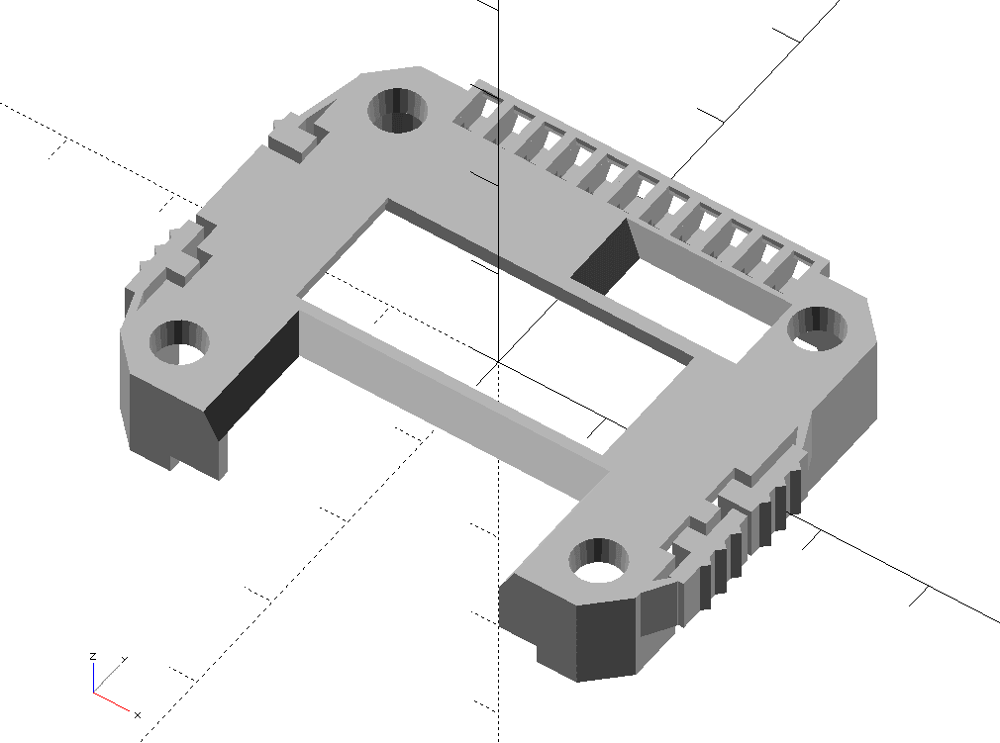

# A cover generator for the CARD10 badge!
 
          
## Cover features:
- 24576 variations possible!!!
- buttons become much more usable as they get a bigger surface
- the cover can be clipped onto the badge - there are no tools required to change the cover
- you can add a piece of clear plastic (e.g. cutout from a pet bottle) as display protection 
- the model has no overhangs, thus it is very easy to print (except if you turn side led's on)
- you can turn off the randomization and generate exactly the cover that YOU want!
        
        
## How to use
- Open the .scad file in openSCAD (download from https://www.openscad.org/)
- [_optional_]: adjust settings below in the section 'CUSTOMIZE YOUR COVER BY ADJUSTING VALUES BELOW:'
- hit the render button in openSCAD (the button above the code with the hourglass & the cube)
- hit the .stl export button right next to the render button
- print your .stl model!
        
        
## Printing instructions

- print upside down without support
- recommended slicer settings: 
            0.1mm layer height
            0.4mm wall thickness
            100% infill with 
            0.4mm extruder
  
  
## Assembly instructions

- clean up the print with a small utility knife
- [_optional_]: cut a 14mm x 30mm piece of clear plastic as display protection (e.g. from a pet-bottle) and place it inside the display cutout  
- clip the cover onto your card10 badge
- post a picture of your covered badge with the hashtag **#card10**
